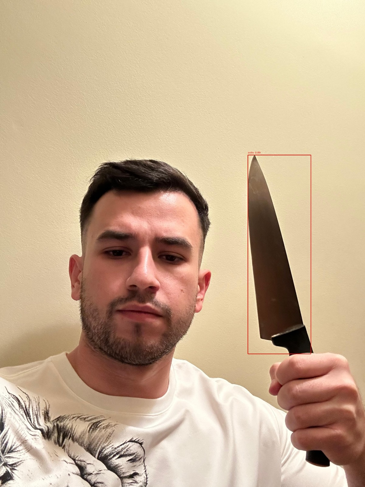
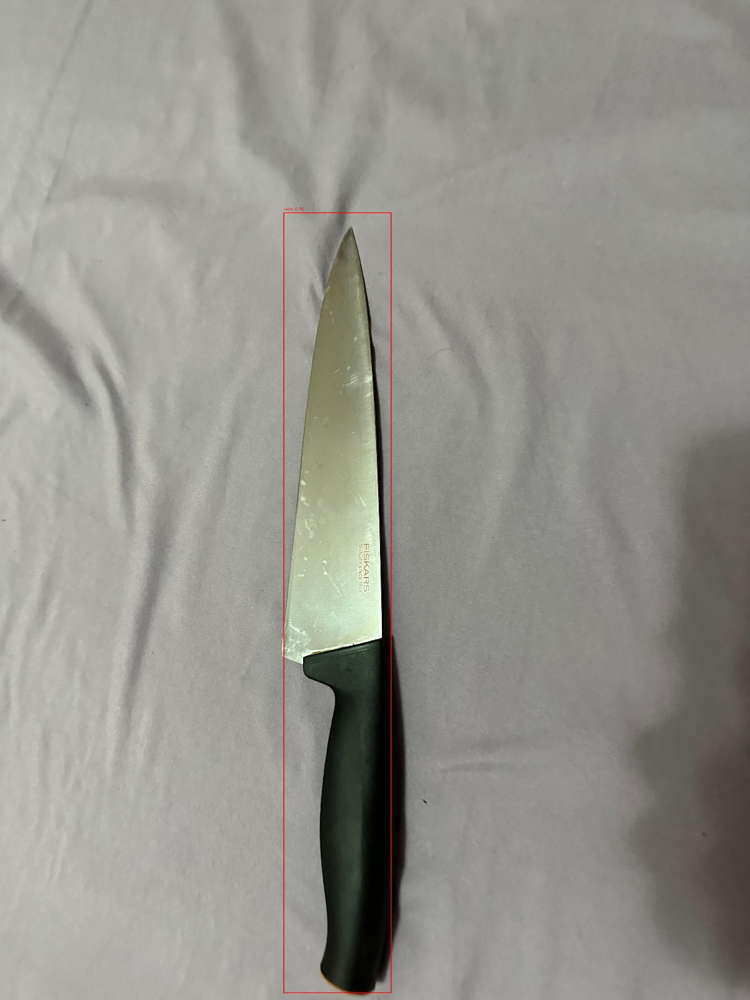

# 🔍 Computer Vision Project: Weapons Detection in Pictures and Videos

## 👨‍💻 Project Overview

### 🏆 Author: Neaga Matei  
### 📍 Location: Bucharest, 2025  

This project focuses on developing an **automated system** for detecting weapons (e.g., **handguns 🔫 and knives 🔪**) in images and video footage using **deep learning**. The primary goal is to **enhance public safety** by leveraging artificial intelligence for **real-time surveillance applications**.

🖼️ **Example Detections:**  
  

---

## 📌 Table of Contents

1️⃣ **Introduction**  
2️⃣ **Datasets**  
3️⃣ **Related Research**  
   - 📚 Automatic handgun detection alarm in videos using deep learning  
   - 🔍 Object Detection Binary Classifiers methodology for small object recognition in surveillance  
4️⃣ **Model Architecture**  
5️⃣ **Technical and Practical Approach**  
6️⃣ **Results**  
   - 📷 Detection in Images  
   - 🎥 Detection in Videos  
   - 📊 Performance Graphs  
7️⃣ **Conclusions**  

---

## 1️⃣ Introduction

🔴 **Crime rates involving firearms and knives are high** in many areas, especially where weapons are legally accessible. Early detection of such threats is **essential** to improving security and reducing violent incidents.  

👮 **Traditional surveillance systems** rely heavily on **human operators**, which introduces the risk of **errors and delays**. This project proposes an **AI-powered system** to **automatically detect weapons in video streams** and alert security personnel **in real time**.

---

## 2️⃣ Datasets 📂

Weapon detection requires **high-quality datasets** containing various images and videos with labeled objects. This project utilizes datasets structured for:

✔️ **Handguns** 🔫  
✔️ **Knives** 🔪  
✔️ **Objects that resemble weapons** (e.g., smartphones 📱, wallets 👛)

📢 **The datasets are publicly available and designed for research purposes.**

---

## 3️⃣ Related Research 📖

### 3.1 🚨 **Automatic Handgun Detection in Videos Using Deep Learning**

📌 **Study by:** Olmos, R., Tabik, S., & Herrera, F. (2018)  
🔹 Utilizes **deep convolutional neural networks (CNNs)** for detecting handguns in video footage  
🔹 Employs **Faster R-CNN** for reducing false positives  
🔹 Introduces **Alarm Activation Time per Interval (AATpI)** as a performance metric  

### 3.2 🛡 **Object Detection Binary Classifiers for Surveillance**

📌 **Study by:** Pérez-Hernández, F., et al. (2020)  
🔹 Focuses on detecting small objects using **binarization techniques**  
🔹 Implements a **two-tiered CNN-based approach** for distinguishing weapons from similar-looking objects  
🔹 Reduces **false positives** through refined classification methodologies  

---

## 4️⃣ Model Architecture 🏗️

The system is based on the **YOLOv8 (You Only Look Once) object detection model**, optimized for **real-time processing** ⚡.

💡 **Main Components:**
- **Backbone 🏋️**: Extracts hierarchical features from images 📸
- **Neck 🔗**: Aggregates and fuses features from different layers 🧩
- **Head 🎯**: Outputs bounding boxes and confidence scores for detected objects 🎯

🔥 **Key Improvements in YOLOv8:**
✔️ Faster processing via **single-pass image analysis** 🚀
✔️ Advanced **anchor-free** detection for improved adaptability 🧠
✔️ **Cross Stage Partial Network (CSPNet)** backbone for efficient feature extraction 🏗️
✔️ **Path Aggregation Network (PANet)** for multi-scale object detection 🛠️

---

## 5️⃣ Technical and Practical Approach 🛠️

### 🖼️ Image Detection - `detect-images.py`

✔️ Loads and preprocesses images using **OpenCV** (`cv2.imread`)  
✔️ Runs inference with **YOLOv8** using pre-trained weights  
✔️ Draws **bounding boxes** around detected weapons 🔲  
✔️ Saves annotated images for visualization 🎨  

### 📂 Batch Processing
✔️ Automates detection for multiple images using `process_images_in_folder`  
✔️ Processes **training and test datasets** in bulk 📊  

### 🎥 Video Detection - `detect-videos.py`
✔️ Reads **video frames** using `cv2.VideoCapture`  
✔️ Applies **YOLOv8 model** for weapon detection 🔍  
✔️ Overlays bounding boxes and labels on frames 📸  
✔️ Writes **processed frames into a new video file** 🎞️  

### 📡 Batch Video Processing
✔️ Enables **large-scale video analysis** 📊  
✔️ Facilitates **real-time surveillance and forensic investigations** 🔍  

---

## 6️⃣ Results 📊

### 🖼️ 6.1 Images
✔️ **Demonstrates** the model's effectiveness in detecting weapons across various conditions 🌟  
✔️ Handles **different lighting, occlusions, and backgrounds** 🏙️

### 🎥 6.2 Videos
✔️ Successfully **detects weapons** in **dynamic environments** 🚔  
✔️ Maintains **high precision** while minimizing **false alarms** 📉  

### 📈 6.3 Performance Metrics
📌 **Categorical Cross-Entropy Loss:** Tracks training loss across epochs 📉  
📌 **Precision:** Measures correct positive detections 🎯  
📌 **Recall:** Measures how well the model detects all actual weapons 🔍  
📌 **mAP@50 (Mean Average Precision at 50% IoU):** Evaluates detection accuracy 📊  

---

## 7️⃣ Conclusions 🏆

This project successfully implemented a **deep learning-based weapon detection system** using **YOLOv8**. The model demonstrated **high accuracy** in real-world applications, making it **suitable for security and surveillance tasks**. 🛡️

### 🔑 Key Findings:
✔️ **YOLOv8** provides a balance of **speed** and **accuracy** ⚡  
✔️ **Wavelet preprocessing** enhances feature extraction 🧠  
✔️ **Dataset compression** allows deployment on **low-resource systems** 📉  
✔️ The model **minimizes false positives and negatives** ✅  

### 🚀 Future Work:
✔️ **Multi-scale detection** for better small object recognition 🔍  
✔️ **Edge computing integration** for real-time processing ⚡  
✔️ **Reducing dataset imbalance** for improved model generalization 📊  

📢 **This project lays the foundation for intelligent surveillance systems, providing an efficient and scalable solution for public safety!** 🔥

